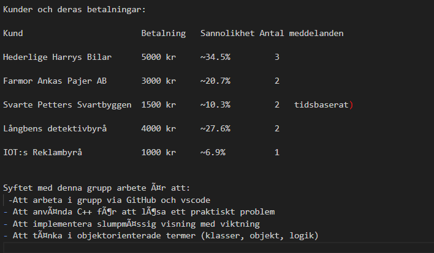

Reklamskyltsystem - C++ Lösning

Översikt

Detta program implementerar ett digitalt reklamskyltsystem där olika kunder får visning baserat på hur mycket de betalat. 
Systemet säkerställer att samma kund aldrig visas två gånger på raken.

Funktioner
Huvudfunktioner

1- Viktad slumpning: Kunder väljs med sannolikhet proportionell mot deras betalning.

2- Aldrig samma kund två gånger på raken: Systemet kommer ihåg senaste kunden.

3- Olika visningstyper: Text, scrollande text, blinkande text.

4- Tidsbaserad logik: Svarte Petter visar olika meddelanden på jämna/ojämna minuter.

5- 20 sekunders visning: Varje reklam visas i exakt 20 sekunder.

Kunder och deras betalningar:

Syftet med denna grupp arbete är att:
 -Att arbeta i grupp via GitHub och vscode 
- Att använda C++ för att lösa ett praktiskt problem
- Att implementera slumpmässig visning med viktning
- Att tänka i objektorienterade termer (klasser, objekt, logik)